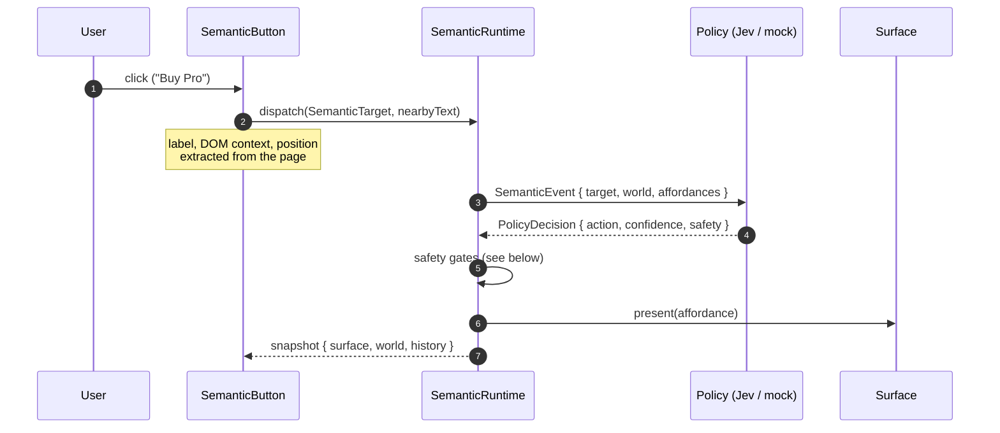
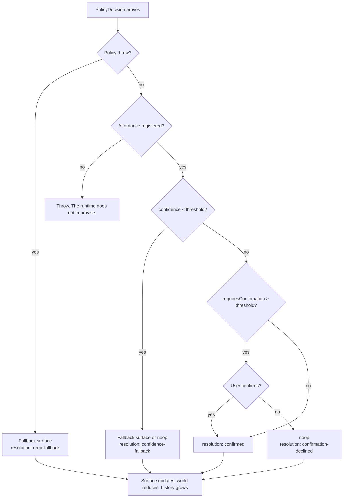

# NoFlow

Tired of knowing exactly what your button does?

NoFlow lets a button describe what happened, asks a policy what that probably means, and presents one of the UI affordances your app registered. A little ridiculous. Potentially useful.

Change `Buy Pro` to `Compare plans` and the prototype can change with it. NoFlow does not draw another flowchart to celebrate. It does, however, draw exactly one diagram to explain itself. Here it is.

## How it works

The button reports. The policy guesses. The runtime decides what is actually allowed to happen.



Nothing in that sequence is a route. The policy only picks from the affordances your app registered; the runtime has the final word.

## The seatbelt

Every decision passes through the same gates before it reaches a surface.



## Install

```bash
npm install noflow-runtime
```

React 18.2 or newer is required. NoFlow does not add a router, state manager, or model SDK to the client bundle. Jev is optional. The local mock policy is enough to play with the idea.

## Put it in a new app

```tsx
import { SemanticRuntime, HttpSemanticPolicy } from 'noflow-runtime/core'
import { SemanticButton, useSemanticRuntime } from 'noflow-runtime/react'

type Surface = 'welcome' | 'checkout' | 'support'
type World = Record<string, unknown> & { loggedIn: boolean }

const runtime = new SemanticRuntime(
  new HttpSemanticPolicy<Surface, World>('/api/semantic-transition'),
  { loggedIn: true },
  {
    affordances: ['welcome', 'checkout', 'support'],
    initialSurface: 'welcome',
    confidenceThreshold: 0.65,
    confirmationThreshold: 0.7,
    fallbackSurface: 'welcome',
    confirm: ({ target }) => window.confirm(`Continue with "${target.label}"?`),
  },
)

function App() {
  const snapshot = useSemanticRuntime(runtime)

  return (
    <>
      <p>Current surface: {snapshot.surface}</p>
      <SemanticButton runtime={runtime} id="primary-cta" position="primary">
        Buy Pro
      </SemanticButton>
    </>
  )
}
```

The button has no domain-specific `onClick`. Its label, visible DOM context, position, world state, and registered affordances become a `SemanticEvent`. The button reports the situation. It does not decide its own destiny.

`SemanticButton` extracts a bounded summary from its nearest semantic container, section, article, form, or main element. Add `data-semantic-context` to a container to choose the extraction boundary. The optional `nearbyText` prop remains available for context that only the application knows.

The root import remains available for compatibility, but subpath imports keep framework-specific code out of consumers that only need the core:

```ts
import { SemanticRuntime } from 'noflow-runtime/core'
import { SemanticButton } from 'noflow-runtime/react'
import { JevSemanticPolicy } from 'noflow-runtime/server'
```

`SemanticRuntime` only accepts a `present` action whose component belongs to the registered affordance list. A policy cannot render arbitrary components or execute arbitrary JavaScript. The vibes are constrained.

The runtime can enforce safety gates after the policy responds. A decision below `confidenceThreshold` uses `fallbackSurface` when configured. A decision whose `safety.requiresConfirmation` reaches `confirmationThreshold` calls `confirm`; if it returns false, the runtime applies `noop` and keeps the proposed action in `policyAction` for inspection. If the policy throws, the runtime uses the registered fallback and marks the decision as `error-fallback`. Even an experimental button needs a seatbelt.

## Give it Jev

Keep the Jev key on the server. The package includes a server-side policy and a standard Web Request handler, so it works in a Node, edge, or framework route without a Vite plugin. Jev gets to make the guess. Your app still gets to say what is allowed.

```ts
import { createSemanticPolicyHandler, JevSemanticPolicy } from 'noflow-runtime/server'

const policy = new JevSemanticPolicy({
  apiKey: process.env.TYPESAFE_API_KEY!,
  descriptions: {
    checkout: 'A purchase or subscription surface.',
    support: 'A help or human-assistance surface.',
  },
})

const semanticTransition = createSemanticPolicyHandler(policy)

export default function handle(request: Request) {
  return semanticTransition(request)
}
```

The browser calls your `/api/semantic-transition` route through `HttpSemanticPolicy`. Jev chooses only from the affordances sent by the runtime. It does not create routes, components, or executable code. No tiny robot is editing your source code at click time.

## The playground

This repository also contains the slightly over-instrumented playground used to poke at the runtime:

```bash
npm install
npm run dev
```

The playground uses a local heuristic policy by default. Change the copy, click the button, toggle world state, or simulate a policy outage. The debug panel is intentionally left on. This is where the idea gets to look a bit silly before it has to behave.

To use the included Vite development endpoint backed by Jev, create `.env.local`:

```env
VITE_POLICY_MODE=jev
TYPESAFE_API_KEY=your_key_here
```

That endpoint is for the playground. New applications should use `JevSemanticPolicy` in their own server route.

## Package development

```bash
npm run check:package
```

This builds the ESM package, imports it from the generated artifact, and checks the important failure paths before previewing the npm tarball. Runtime history keeps 50 transitions by default; set `historyLimit` in the runtime options when you need a different debug window.

## What this is

It is an installable runtime, not a screenshot pretending to be a framework. The playground is optional and intentionally loud. The package works without it, and the package does not pretend to know more than your affordance list allows.

Maybe somebody builds something completely unhinged with it. That is a better outcome than another button with six nested `if`s and a flowchart nobody wants to open.

## License

MIT
